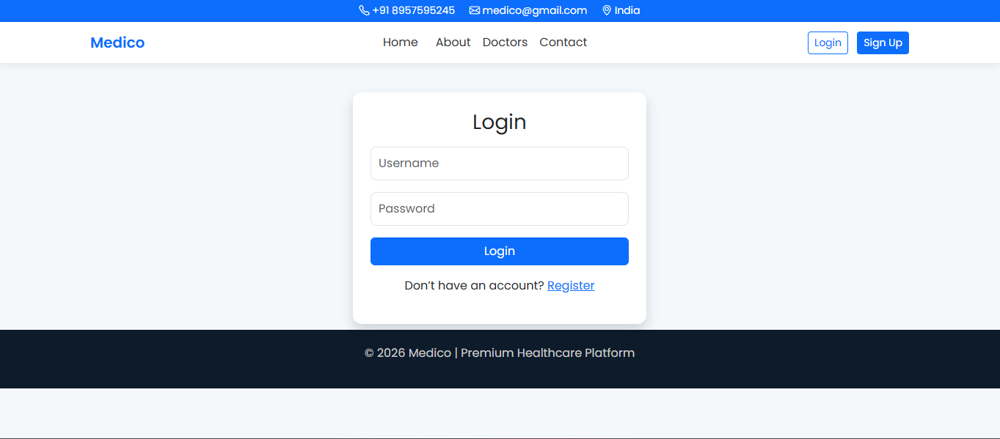
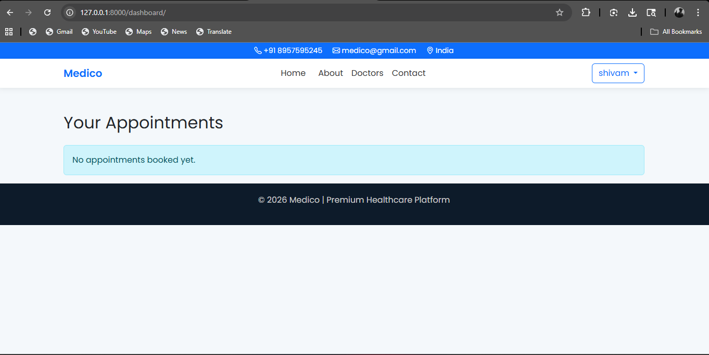

# 🏥 Medico - Django Healthcare Management System

Medico is a web-based healthcare management system built using Django.  
It allows users to register, log in, book appointments with doctors, and contact the hospital.

---

## 🚀 Features

- 🔐 User Authentication (Login / Register / Logout)
- 👨‍⚕️ Doctor Listing Page
- 📅 Appointment Booking System
- 📊 User Dashboard (View & Cancel Appointments)
- 📩 Contact Form (Stores messages in database)
- 🛠️ Admin Panel (Manage Doctors, Appointments, Messages)
- 🎨 Responsive UI using Bootstrap

---

## 🛠️ Tech Stack

- **Backend:** Django (Python)
- **Frontend:** HTML, CSS, Bootstrap
- **Database:** SQLite3
- **Version Control:** Git & GitHub

---

## 📂 Project Structure
medico/
│
├── account/
├── medico/
├── templates/
├── static/
├── images/
└── manage.py

---

## ⚙️ How to Run the Project

### 1️⃣ Clone the repository
```bash
git clone https://github.com/RootAccessShivam/Medico.git
cd Medico
pip install django
python manage.py makemigrations
python manage.py migrate
python manage.py runserver
python manage.py createsuperuser
```

## 📸 Screenshots

### 🏠 Home Page


### 🔐 Login Page


### 📊 Dashboard
